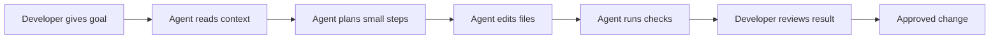

# How AI agents are changing software development

AI agents are changing software development by turning AI from a passive assistant into an active collaborator that can plan work, inspect code, make changes, run checks, and explain trade-offs.

This does not mean developers become less important. It means the developer's role shifts. More time moves toward intent, architecture, review, verification, and product judgment. Less time is spent on repetitive setup, boilerplate, first-pass implementation, and searching through familiar patterns.

Image note: Replace this with a licensed internal image, product screenshot, or approved illustration before publishing if needed.

## From code completion to goal completion

The first wave of AI developer tools mostly helped with code completion. A developer wrote a line or comment, and the tool suggested the next few lines. That was useful, but the responsibility stayed almost entirely with the developer.

AI agents go further. They can take a goal such as "add validation for this form," "fix the failing test," or "create a blog from this Markdown file," then break that goal into smaller steps.

An agent can read nearby files, identify the likely place to change, edit the code, run tests, inspect the result, and revise its approach. The developer still owns the decision, but the agent can carry more of the mechanical work between decisions.

## What changes in the development workflow

AI agents affect the whole software lifecycle, not only code writing. They can help teams move faster in discovery, implementation, testing, documentation, and maintenance.

The practical value appears when an agent has enough context to act safely. That includes the repository structure, coding standards, tests, issue description, and expected output. Without that context, the agent may produce plausible work that still misses the real system behavior.

| Development activity | Traditional workflow | AI-agent-assisted workflow |
| --- | --- | --- |
| Understanding a codebase | Developer searches files manually and builds context slowly | Agent scans relevant files and summarizes the likely change area |
| Implementing changes | Developer writes most code directly | Agent drafts focused changes for review |
| Testing | Developer decides and runs checks manually | Agent can run available checks and use failures to revise |
| Documentation | Often written after implementation | Agent can draft docs from the change and keep them closer to the code |
| Review | Review focuses on code correctness | Review also checks whether the agent understood the requirement |

## Why teams are adopting AI agents

Teams are adopting AI agents because they reduce the friction around common engineering tasks. Developers can move from idea to working draft faster, especially for well-scoped changes.

The strongest use cases are usually bounded and verifiable. Examples include adding tests around known behavior, converting a document into a template, updating repeated UI patterns, generating migration notes, or investigating a failing check.

Research from the [2024 Stack Overflow Developer Survey](https://survey.stackoverflow.co/2024/ai?r=prd-plgs) shows broad interest in AI tools among developers, with many using or planning to use them in the development process. Developers most commonly value productivity gains, learning support, and help with code writing.

Google's DORA research also shows a more nuanced picture. The [2024 DORA report](https://dora.dev/research/2024/dora-report/) and related Google Cloud summaries describe AI as useful for productivity and documentation quality, while warning that better individual speed does not automatically become better delivery performance.

That distinction matters. AI can make one developer faster. It does not automatically make the whole team better at shipping reliable software.

## The new role of the developer

As agents handle more mechanical work, developers become more responsible for framing the work clearly.

A good agent task needs a clear goal, constraints, acceptance criteria, and review expectations. "Improve this" is weak. "Convert this Markdown file into a Kovan blog source, keep the original unchanged, preserve image references, and save the result locally for review" is much stronger.

Developers also need to read agent output with care. AI-generated code can be syntactically correct and still be wrong for the product. It may miss edge cases, misunderstand domain language, overfit to nearby examples, or choose a solution that works locally but does not match team standards.

The best developers in an AI-agent workflow are not just prompt writers. They are problem framers, system thinkers, reviewers, testers, and maintainers.

## Where AI agents help most

AI agents are especially useful when the task has enough structure for verification.

For example, if the goal is to create a blog from a Markdown file, the agent can check whether the branch exists, read the `.md` file, identify headings and image references, map the content into a blog template, and save an output file. The result is easy to review because the source and output are both visible.

In software engineering, similar tasks include:

- Creating tests for an existing module
- Refactoring repeated code without changing behavior
- Updating documentation after an implementation change
- Investigating failing CI logs
- Applying a known pattern across multiple files
- Creating a first draft of a feature behind review

These tasks are valuable because the developer can inspect the diff, run checks, and decide whether the result is acceptable.

## The risks teams need to manage

The biggest risk is not that agents write code. The biggest risk is that teams accept work they do not understand.

If agents make changes faster than developers can review them, the team can accumulate hidden complexity. Code may pass surface checks while becoming harder to reason about. Documentation may sound polished while missing key constraints. Tests may assert behavior without proving the real business rule.

Stack Overflow's 2024 survey shows that trust remains a concern for many developers using AI tools. DORA's research also points toward the same lesson: AI adoption needs strong engineering basics around small changes, testing, review, and stable delivery practices.

AI agents should therefore be introduced with guardrails:

- Keep tasks small enough to review.
- Require tests or validation for behavior changes.
- Ask the agent to explain important decisions.
- Review generated code like any other code.
- Track whether AI-assisted work improves team outcomes, not only individual speed.

## How teams can start well

Teams do not need to redesign their entire engineering process on day one. A better approach is to start with a narrow workflow where the input, output, and review path are clear.

For example, a content workflow can begin with Markdown files in GitHub. The agent reads the Markdown, creates a structured blog draft, preserves the source file, and saves the generated output separately. This gives the team a safe way to test agent behavior without risking production systems.

The same pattern can later apply to code:

1. Pick a bounded task.
2. Define the expected output.
3. Let the agent create a first draft.
4. Run checks.
5. Review the result.
6. Improve the workflow based on what failed.

This turns AI adoption into an engineering practice instead of a one-time tool rollout.

## What this means for software teams

AI agents are not replacing the discipline of software development. They are changing where that discipline is applied.

Teams that get value from agents will still care about architecture, tests, readability, security, accessibility, documentation, and product fit. The agent can help with the work, but it cannot own the consequences.

The future of software development is likely to be more collaborative: developers defining intent, agents doing more of the repeatable execution, and humans reviewing the result with stronger judgment.

The winning teams will not be the ones that generate the most code. They will be the ones that use agents to create better software with clearer thinking, faster feedback, and stronger review habits.

## FAQs

### Are AI agents the same as code completion tools?

No. Code completion tools usually suggest the next line or block of code. AI agents can work across a larger goal by reading files, planning steps, making edits, running checks, and revising based on feedback.

### Will AI agents replace software developers?

AI agents can automate parts of development, but they still need human direction and review. Developers remain responsible for architecture, product judgment, security, maintainability, and final approval.

### What is a safe first use case for AI agents?

A safe first use case is one with clear input and output, such as converting Markdown content into a blog draft, adding tests for known behavior, or updating documentation from an existing change.

### What should teams measure when adopting AI agents?

Teams should measure more than speed. Useful signals include review quality, defect rate, delivery stability, test coverage, documentation quality, and whether developers understand the changes being merged.

## References

- [2024 Stack Overflow Developer Survey: AI](https://survey.stackoverflow.co/2024/ai?r=prd-plgs)
- [DORA Research: 2024 Accelerate State of DevOps Report](https://dora.dev/research/2024/dora-report/)
- [Google Cloud: DORA's new report on generative AI in software development](https://cloud.google.com/blog/products/ai-machine-learning/sharing-new-dora-research-for-gen-ai-in-software-development)

