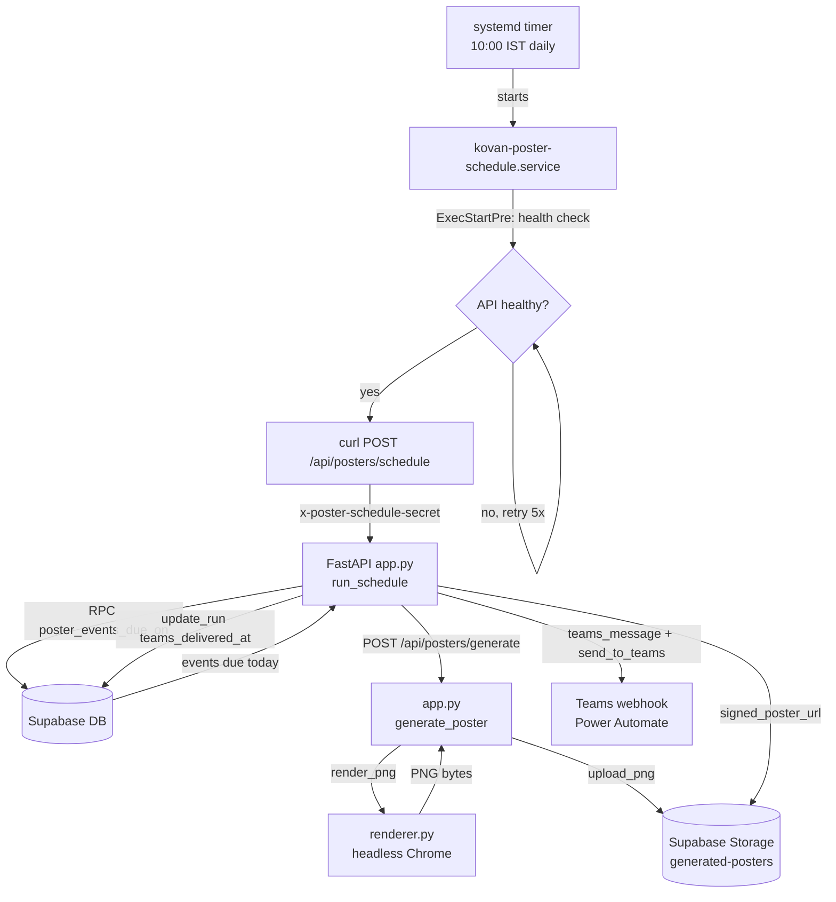

# Kovan Poster Automation — Complete Setup & Run Guide

This guide explains how to set up and run the Kovan Labs **daily poster automation**
on **any device** (fresh machine, new laptop, server, etc.). It covers everything
needed to go from a clean environment to a fully automated pipeline that:

1. Finds employees with a **birthday** or **work anniversary** that day
2. **Generates** a branded poster for each
3. **Stores** the poster in Supabase Storage
4. **Sends** the poster + a personalized message to a **Microsoft Teams** channel

---

## 1. Architecture Overview

The system is a small **client-server** design:



### Key components

| Layer | File | Role |
|-------|------|------|
| Schedule | `systemd/kovan-poster-schedule.timer` | Fires daily at **08:00 IST** |
| Trigger | `systemd/kovan-poster-schedule.service` | Health check + **direct curl** to the API |
| API server | `systemd/kovan-poster-api.service` | Runs the FastAPI server on `127.0.0.1:8000` |
| API logic | `scripts/poster_api/app.py` | `run_schedule` + `generate_poster` + `teams_message()` |
| Rendering | `scripts/poster_api/renderer.py` | `render_png()` (headless Chrome) + `completed_years()` |
| Data access | `scripts/poster_api/supabase.py` | DB queries + Storage uploads |
| HTTP helpers | `scripts/poster_api/http.py` | `post_json()` + `send_to_teams()` |
| Config | `scripts/poster_api/config.py` | Loads `.env.poster-automation` |
| Validation | `scripts/poster_api/models.py` | Pydantic request models |
| Installer | `scripts/install_poster_systemd_timer.sh` | Installs the systemd units |
| Manual trigger | `scripts/run_poster_schedule.py` | Optional manual/test client |

---

## 2. Prerequisites

Install these on the target device:

- **Python 3.10+**
- **Google Chrome** (used by headless rendering)
- **Supabase CLI** (to apply migrations)
- **systemd** (user-level; standard on most Linux distros)

---

## 3. Project Setup

### 3.1 Clone / copy the project

Copy the project folder to the target device, e.g.:

```bash
cd ~/Documents
git clone <your-repo-url> "Content creation"
cd "Content creation"
```

> **Note:** The systemd service files reference the absolute path
> `/home/thansika/Documents/Content creation`. If your path differs, you must
> update the paths in the `.service` files (see [Section 7](#7-install-systemd-units)).

### 3.2 Create the virtual environment and install dependencies

```bash
python3 -m venv .venv
.venv/bin/pip install -r requirements.txt
```

`requirements.txt` contains:

```
beautifulsoup4==4.12.3
Markdown==3.5.2
PyYAML==6.0.1
fastapi==0.116.1
pydantic==2.11.7
uvicorn==0.35.0
```

### 3.3 Configure environment variables

Create `.env.poster-automation` from the example (or copy from an existing device):

```bash
cp .env.poster-automation.example .env.poster-automation
```

Fill in every value. The file must contain:

```bash
SUPABASE_PROJECT_REF=<your-supabase-project-ref>
SUPABASE_SERVICE_ROLE_KEY=<your-service-role-key>
POSTER_SCHEDULE_SECRET=<random-secret>
POSTER_INTERNAL_API_SECRET=<random-secret>
CHROME_BINARY=google-chrome
POSTER_SCHEDULE_URL=http://127.0.0.1:8000/api/posters/schedule
POSTER_GENERATION_URL=http://127.0.0.1:8000/api/posters/generate
TEAMS_WEBHOOK_URL=<your-power-automate-webhook-url>
```

| Variable | Required | Purpose |
|----------|----------|---------|
| `SUPABASE_PROJECT_REF` | ✅ | Supabase project reference |
| `SUPABASE_SERVICE_ROLE_KEY` | ✅ | Service role key (server-side, keep secret) |
| `POSTER_SCHEDULE_SECRET` | ✅ | Auth header for the schedule endpoint |
| `POSTER_INTERNAL_API_SECRET` | ✅ | Auth header for the generate endpoint |
| `CHROME_BINARY` | ✅ | Path/name of the Chrome binary |
| `POSTER_SCHEDULE_URL` | ✅ | Local schedule endpoint |
| `POSTER_GENERATION_URL` | ✅ | Local generate endpoint |
| `TEAMS_WEBHOOK_URL` | ⬜ | Power Automate webhook. **Optional** — without it, posters are generated/stored but **not** sent to Teams |

> **Security:** `.env.poster-automation` contains secrets. Do **not** commit it to
> version control. Add it to `.gitignore`.

---

## 4. Create the Power Automate Flow (Teams Delivery)

The poster is delivered to Teams through a **Power Automate flow** that is
triggered by a **Teams webhook request**. The API posts a JSON payload
(`{ "message": ..., "imageUrl": ... }`) to the flow's webhook URL, and the flow
posts that message + image to a Teams channel.

### 4.1 Create the flow

1. Go to **https://make.powerautomate.com** and sign in.
2. Click **Create** → **Instant cloud flow**.
3. Give it a name (e.g., `Kovan Poster to Teams`).
4. Choose the trigger **"When a Teams webhook request is received"** and click
   **Create**.

### 4.2 Configure the Teams webhook trigger

In the trigger step, set the **Request Body JSON Schema** to match the payload
the API sends:

```json
{
  "type": "object",
  "properties": {
    "message": {
      "type": "string"
    },
    "imageUrl": {
      "type": "string"
    }
  },
  "required": ["message", "imageUrl"]
}
```

This trigger provides a **webhook URL** that the API calls to start the flow.

### 4.3 The flow structure

The flow has **three steps**:

1. **Trigger:** The flow starts when a Teams webhook request is received.
2. **Action 1:** Posts a message in a Teams channel using the content from the
   webhook.
3. **Action 2:** Posts an **Adaptive Card** in the same Teams channel, including
   the message and an image, after the message is posted.

#### Action 1 — Post the message

1. Click **+ New step**.
2. Search for and select **Microsoft Teams** → **Post message in a chat or channel**.
3. Configure it:
   - **Post as:** Flow bot
   - **Post in:** Channel
   - **Team:** select your team
   - **Channel:** select the channel where posters should appear
   - **Message:** use the dynamic content from the trigger, e.g.:
     ```
     @{triggerBody()?['message']}
     ```

#### Action 2 — Post the Adaptive Card (with image)

1. Click **+ New step**.
2. Search for and select **Microsoft Teams** → **Post adaptive card in a chat or
   channel**.
3. Configure it with the same **Team** and **Channel**.
4. Build the card to include the message and the poster image. A minimal card
   JSON looks like:

   ```json
   {
     "type": "AdaptiveCard",
     "$schema": "http://adaptivecards.io/schemas/adaptive-card.json",
     "version": "1.4",
     "body": [
       {
         "type": "TextBlock",
         "text": "@{triggerBody()?['message']}",
         "wrap": true
       },
       {
         "type": "Image",
         "url": "@{triggerBody()?['imageUrl']}"
       }
     ]
   }
   ```

   Use the dynamic content `@{triggerBody()?['message']}` for the text and
   `@{triggerBody()?['imageUrl']}` for the image URL.

### 4.4 Save and copy the webhook URL

1. Click **Save**.
2. In the **Teams webhook trigger** step, copy the **webhook URL** that Power
   Automate generated. It looks like:

   ```
   https://default<...>.environment.api.powerplatform.com:443/powerautomate/automations/direct/cu/<...>/triggers/manual/paths/invoke?api-version=1&sp=%2Ftriggers%2Fmanual%2Frun&sv=1.0&sig=<...>
   ```

3. Paste this URL into `TEAMS_WEBHOOK_URL` in `.env.poster-automation`.

### 4.5 How the API calls the flow

The API's `send_to_teams()` (in `scripts/poster_api/http.py`) POSTs this JSON to
the webhook URL:

```json
{
  "message": "Happy 5 Years Work Anniversary, Bob! 🎉",
  "imageUrl": "https://<supabase>.supabase.co/storage/v1/object/sign/generated-posters/..."
}
```

The flow receives it, extracts `message` and `imageUrl`, and posts them to the
configured Teams channel.

> **Tip:** You can test the flow directly with a tool like `curl` or Postman by
> POSTing a sample payload to the webhook URL before wiring it into the API.

---

## 5. Apply Supabase Migrations

The migrations create the recurring-event RPCs, the idempotent `poster_runs`
table, the private Storage buckets, and Teams delivery tracking.

```bash
npx supabase db push
```

Key migration files (in `supabase/migrations/`):

- `202607270001_poster_automation.sql` — base tables
- `202607270002_storage_only_posters.sql` — storage setup
- `202607270003_recurring_event_types.sql` — recurring event types
- `202607270005_supabase_svg_pipeline.sql` — defines `poster_events_due_on` and `claim_poster_run`

The `poster_events_due_on(requested_date)` SQL function is the **source of truth**
for "who is celebrating today". It returns events where the month/day of
`event_date` matches the requested date.

---

## 6. Start the API Manually (for testing)

```bash
.venv/bin/uvicorn scripts.poster_api.app:app --host 127.0.0.1 --port 8000
```

Verify it's healthy:

```bash
curl http://127.0.0.1:8000/health
# → {"status":"ok"}
```

Interactive API docs are available at `http://127.0.0.1:8000/docs`.

---

## 7. Trigger the Schedule Manually (for testing)

The schedule endpoint defaults to **today's date** when no date is passed.

```bash
# Today
.venv/bin/python scripts/run_poster_schedule.py

# A specific test date
.venv/bin/python scripts/run_poster_schedule.py --date 2026-07-28
```

Or call the API directly with `curl` (same as the systemd service does):

```bash
cd "/home/thansika/Documents/Content creation"
set -a; source .env.poster-automation; set +a
curl -sfS -X POST "$POSTER_SCHEDULE_URL" \
  -H "Content-Type: application/json" \
  -H "x-poster-schedule-secret: $POSTER_SCHEDULE_SECRET" \
  -d "{}"
```

### Expected response

```json
{
  "date": "2026-08-06",
  "matched": 2,
  "generated": 1,
  "delivered": 1,
  "skipped": 1,
  "failures": []
}
```

| Field | Meaning |
|-------|---------|
| `matched` | Events due that day |
| `generated` | Posters generated + stored |
| `delivered` | Posters sent to Teams |
| `skipped` | Already delivered (dedup) or no webhook configured |
| `failures` | Any errors |

> **Note:** `skipped` is **normal** when a poster was already delivered that day
> (the `teams_delivered_at` flag prevents duplicates).

---

## 8. Install Systemd Units

### 7.1 The unit files

The project ships three systemd unit files in `systemd/`:

**`kovan-poster-api.service`** — keeps the FastAPI server running:

```ini
[Unit]
Description=Kovan poster API
Wants=network-online.target
After=network-online.target

[Service]
Type=simple
WorkingDirectory=/home/thansika/Documents/Content creation
ExecStart=/bin/bash -lc 'cd "/home/thansika/Documents/Content creation" && "/home/thansika/Documents/Content creation/.venv/bin/uvicorn" scripts.poster_api.app:app --host 127.0.0.1 --port 8000'
Environment=PYTHONUNBUFFERED=1
Restart=on-failure
RestartSec=5
StandardOutput=journal
StandardError=journal

[Install]
WantedBy=default.target
```

**`kovan-poster-schedule.service`** — the daily trigger (oneshot). It health-checks
the API, then calls it **directly with `curl`** (no Python client needed):

```ini
[Unit]
Description=Kovan poster scheduled database query and image generation
Wants=network-online.target kovan-poster-api.service
Requires=kovan-poster-api.service
After=network-online.target kovan-poster-api.service kovan-poster-api.service

[Service]
Type=oneshot
ExecStartPre=/bin/bash -lc 'for i in 1 2 3 4 5; do if curl -sfS http://127.0.0.1:8000/health >/dev/null 2>&1; then exit 0; fi; sleep 1; done; echo "API not responding on http://127.0.0.1:8000" >&2; exit 1'
ExecStart=/bin/bash -lc 'cd "/home/thansika/Documents/Content creation" && set -a && source .env.poster-automation && set +a && curl -sfS -X POST "$POSTER_SCHEDULE_URL" -H "Content-Type: application/json" -H "x-poster-schedule-secret: $POSTER_SCHEDULE_SECRET" -d "{}"'
Environment=PYTHONUNBUFFERED=1
StandardOutput=journal
StandardError=journal
```

**`kovan-poster-schedule.timer`** — fires the service daily at **08:00 IST**:

```ini
[Unit]
Description=Run Kovan poster automation daily at 08:00 Asia/Kolkata

[Timer]
OnCalendar=*-*-* 08:00:00 Asia/Kolkata
Persistent=true
Unit=kovan-poster-schedule.service

[Install]
WantedBy=timers.target
```

> **Important:** If your project path differs from
> `/home/thansika/Documents/Content creation`, update the `WorkingDirectory` and
> `ExecStart` paths in the `.service` files **before** installing.

### 7.2 Run the installer

```bash
chmod +x scripts/install_poster_systemd_timer.sh
./scripts/install_poster_systemd_timer.sh
```

The installer:
1. Copies `systemd/*.service` and `systemd/*.timer` into `~/.config/systemd/user/`
2. Runs `systemctl --user daemon-reload`
3. Restarts the timer
4. Lists the timers to confirm

### 7.3 Enable services to start on boot

```bash
systemctl --user enable kovan-poster-api.service
systemctl --user enable kovan-poster-schedule.timer
```

### 7.4 Verify

```bash
systemctl --user list-timers kovan-poster-schedule.timer --no-pager
```

You should see the next fire time (e.g., `Fri 2026-08-07 03:10:00 IST`).

---

## 9. Useful Systemd Commands

```bash
# Status
systemctl --user status kovan-poster-api.service
systemctl --user status kovan-poster-schedule.timer
systemctl --user status kovan-poster-schedule.service

# Start / restart
systemctl --user start kovan-poster-schedule.service
systemctl --user restart kovan-poster-api.service

# Logs
journalctl --user -u kovan-poster-api.service
journalctl --user -u kovan-poster-schedule.service
```

---

## 10. Changing the Schedule Time

To change the daily run time, edit `OnCalendar` in
`systemd/kovan-poster-schedule.timer`, then apply:

```bash
cp systemd/kovan-poster-schedule.timer ~/.config/systemd/user/kovan-poster-schedule.timer
systemctl --user daemon-reload
systemctl --user restart kovan-poster-schedule.timer
systemctl --user list-timers kovan-poster-schedule.timer --no-pager
```

> The installed file in `~/.config/systemd/user/` is a **separate copy**, not a
> symlink — so you must copy it over after editing the workspace copy.

---

## 11. The Personalized Teams Message

The message sent to Teams is built by `teams_message()` in
`scripts/poster_api/app.py`:

| Event type | Message |
|------------|---------|
| Birthday | `Happy Birthday, {name}! 🎉` |
| Work anniversary | `Happy {years} Year(s) Work Anniversary, {name}! 🎉` |

The years are computed from the event date to the occurrence date using
`completed_years()` in `scripts/poster_api/renderer.py`, with correct
singular/plural handling (e.g., "1 Year" vs "5 Years").

---

## 12. Troubleshooting

### API won't start — "Could not import module"

Make sure the uvicorn module path uses a **dot**, not a slash:

```bash
# ✅ Correct
.venv/bin/uvicorn scripts.poster_api.app:app --host 127.0.0.1 --port 8000

# ❌ Wrong (causes "Could not import module")
.venv/bin/uvicorn scripts.poster_api/app:app --host 127.0.0.1 --port 8000
```

### "Connection refused" when triggering the schedule

The API isn't running. Start it:

```bash
systemctl --user start kovan-poster-api.service
# or manually:
.venv/bin/uvicorn scripts.poster_api.app:app --host 127.0.0.1 --port 8000
```

### Posters generated but not sent to Teams

`TEAMS_WEBHOOK_URL` is not set in `.env.poster-automation`. Add it and restart
the API.

### Everything is "skipped"

That's expected — the posters for that date were already delivered
(`teams_delivered_at` is set). This prevents duplicate sends.

### Chrome not found

Ensure Chrome is installed and `CHROME_BINARY` in `.env.poster-automation`
points to the correct binary (e.g., `google-chrome`).

---

## 13. Cron Fallback (Alternative to systemd)

If systemd is not available, a cron-based installer is provided at
`scripts/install_poster_cron.sh`. It installs a daily job at **10:00 Asia/Kolkata**
that calls `scripts/run_poster_schedule.py`.

```bash
chmod +x scripts/install_poster_cron.sh
./scripts/install_poster_cron.sh
```

> The cron path still uses `run_poster_schedule.py` (the Python client), unlike
> the systemd path which calls the API directly with `curl`.

---

## 14. Summary of the Daily Automated Flow

1. **08:00 IST** — `kovan-poster-schedule.timer` fires
2. **`kovan-poster-schedule.service`** starts (oneshot)
3. **Health check** waits for the API on `127.0.0.1:8000`
4. **Direct `curl`** POSTs to `/api/posters/schedule` with the schedule secret
5. **`run_schedule`** queries `poster_events_due_on(today)` → events due today
6. For each event, **`generate_poster`**:
   - Downloads the employee photo (work anniversaries)
   - `render_png()` → headless Chrome renders the poster
   - Uploads the PNG to Supabase `generated-posters`
   - Marks the run as `stored`
7. **`run_schedule`** builds the message via `teams_message()` and sends it +
   the poster to **Teams** via `send_to_teams()`
8. Records `teams_delivered_at` (prevents duplicate sends)

No manual steps required — the pipeline runs fully automatically every day.
